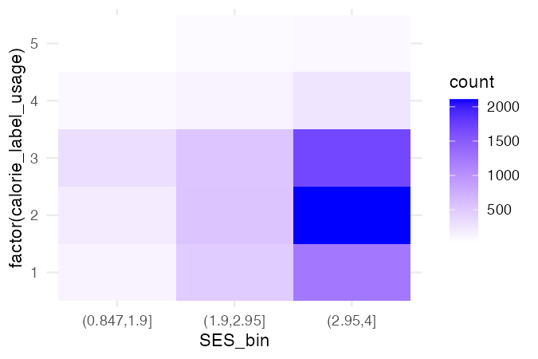
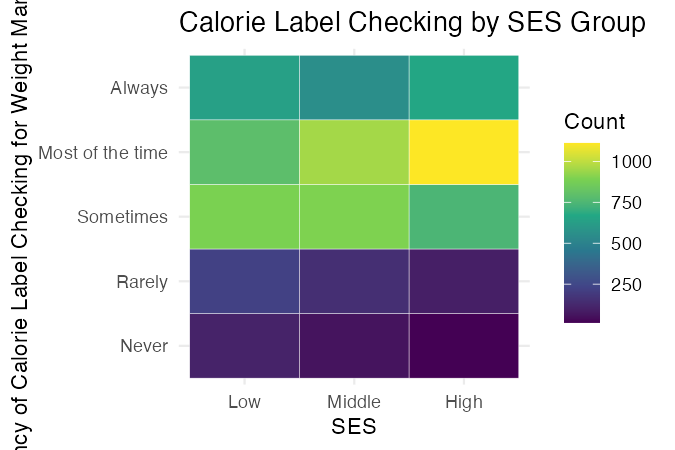

```{r setup, include=FALSE}
knitr::opts_chunk$set(echo=FALSE, eval=TRUE, warning=FALSE, message=FALSE)
```

```{r}
library(rio)
library(here)
library(tidyverse)
library(scales)
```

```{r}
weight2 <- import(here("data", "sesdata.rds"))
```

```{r}
plot21 <- weight2 %>%
  mutate(SES_bin = cut(SES, breaks = 3)) %>% 
  ggplot(aes(x = SES_bin, y = factor(calorie_label_usage))) +
  geom_bin2d() +
  scale_fill_gradient(low = "white", high = "blue") +
  theme_minimal() 

ggsave("plot21.png", plot21, width=4.5, height=3, dpi = 150)
```

```{r}
plot22 <- weight2 %>%
  mutate(
    SES_group = cut(SES, 
                  breaks = quantile(SES, probs = c(0, 1/3, 2/3, 1), na.rm = TRUE),
                  include.lowest = TRUE,
                  labels = c("Low", "Middle", "High")),
    calorie_label_usage = recode(calorie_label_usage,
                                 `1` = "Always",
                                 `2` = "Most of the time",
                                 `3` = "Sometimes",
                                 `4` = "Rarely",
                                 `5` = "Never"),
    calorie_label_usage = factor(calorie_label_usage, 
                                 levels = c("Never", "Rarely", "Sometimes", "Most of the time", "Always"))
  ) %>% 
  count(SES_group, calorie_label_usage) %>%
  ggplot(aes(x = SES_group, y = calorie_label_usage, fill = n)) + 
  geom_tile(color = "white") + 
  scale_fill_viridis_c(option = "D") +
  theme_minimal() +
  labs(
    x = "SES",
    y = "Frequency of Calorie Label Checking for Weight Management",
    fill = "Count",
    title = "Calorie Label Checking by SES Group"
  )

ggsave("plot22.png", plot22, width=4.5, height=3, dpi = 150)
```

## Final Plots

These plots were created to examine how socioeconomic status (SES) is associated with the frequency of calorie label checking for weight management. People who want to control their weight often check calorie information when purchasing food. If the frequency of this behavior differs by SES, it could suggest that certain SES groups are more engaged in weight management. For this analysis, I created two final plots, which categorized SES into three groups: low, middle, and high. Individuals below the 25th percentile are classified as low SES, those above the 75th percentile as high SES, and those in between as middle SES. 

First, the heatmap illustrates the total number of responses regarding how often individuals check the calories on food labels by SES group. Darker colors, such as dark red and black, indicate a higher number of responses, while lighter colors represent fewer responses. The ‘rocket’ color option is part of the viridis scale, transitioning from light to dark in a gradient. It is colorblind-friendly while effectively representing value differences in an ordered manner. The heat map shows that more people check calories than those who do not across all SES groups. The “most of the time” and “sometimes” columns of the middle SES group are the darkest, indicating that the middle class uses calorie checks most frequently. However, since it is not easy to directly compare the extent of calorie label checks within SES groups in the heat map, an additional bar graph was created. 

```{r, fig.width=8, fig.height=6}
weight2 <- weight2 %>%
  mutate(
    SES_group = cut(SES, breaks = quantile(SES, probs = c(0, 0.25, 0.75, 1), na.rm = TRUE),
                         include.lowest = TRUE,
                         labels = c("Low", "Middle", "High")),
    calorie_label_usage = recode(calorie_label_usage,
                                 `1` = "Always",
                                 `2` = "Most of the time",
                                 `3` = "Sometimes",
                                 `4` = "Rarely",
                                 `5` = "Never"),
    calorie_label_usage = factor(calorie_label_usage, 
                                 levels = c("Never", "Rarely", "Sometimes", "Most of the time", "Always")))

weight2 %>%
  count(SES_group, calorie_label_usage) %>%
  ggplot(aes(x = SES_group, y = calorie_label_usage, fill = n)) + 
  geom_tile(color = "white") + 
  scale_fill_viridis_c(option = "rocket", direction = -1) +
  theme_minimal() +
  labs(x = "SES",
       y = NULL,
       fill = "Count",
       title = "Calorie Label Checking Frequency by SES")
```

```{r, fig.width=8, fig.height=6}
weight2 %>%
  count(SES_group, calorie_label_usage) %>%
  group_by(SES_group) %>%
  mutate(percentage = n / sum(n) * 100) %>%
  ggplot(aes(x = calorie_label_usage, y = percentage, fill = SES_group)) + 
  geom_bar(stat = "identity", position = "dodge", color = "black") + 
  ylim(NA, 45) +
  coord_flip() +
  scale_fill_manual(values = c("Low" = "#ffffe6", "Middle" = "#fb9929", "High" = "#65270b"),
                    breaks = c("High", "Middle", "Low")) +
  theme_minimal() +
  theme(panel.grid.minor.x = element_blank(),
        panel.grid.major.y = element_blank(),
        panel.grid.minor.y = element_blank(),
        plot.margin = margin(10, 20, 10, 10)) +
  labs(x = NULL,
       y = "Percentage (%)",
       fill = "Socioeconomic Status",
       title = "Calorie Label Checking Percentage by SES") +
  geom_text(aes(label = paste0(round(percentage, 1), "%")),
            position = position_dodge(width = 0.8),
            vjust = 0.5,
            hjust = -0.1,
            size = 3)
```
Data Source: [NHANES 2017-March 2020](https://wwwn.cdc.gov/nchs/nhanes/continuousnhanes/default.aspx?Cycle=2017-2020)

This bar graph displays the percentage distribution of calorie labels checking frequency across SES groups. The bar graph reveals that individuals in the high SES group have the highest rates of checking calorie labels for “always” and “most of the time”, followed by those in the middle and low SES groups. Meanwhile, the low SES group has the highest proportion of individuals who “rarely” or “never” check calories. Therefore, it can be seen that the higher the SES, the more often they check calories on food labels for weight control.

The intended audiences for these plots are public health policymakers and people in the health and food industries. By seeing the differences in calorie label checking across SES groups, they could develop tailored weight management programs or design food packaging that emphasizes different health benefits or nutritional information in particular products that are more likely to be consumed by certain SES groups.

## Drafts

<div>
  <button onclick="showPlot('plot21')">Draft 1</button>
  <button onclick="showPlot('plot22')">Draft 2</button>
</div>

<div>
(Click the Draft buttons to view previous plots)
</div>

<div id="plot-container">
  
  
</div>

<script>
  function showPlot(plotId) {
    document.getElementById('plot21').style.display = "none";
    document.getElementById('plot22').style.display = "none";
    document.getElementById(plotId).style.display = "block";
  }
</script>

Before finally adding the bar graph, creating a heatmap was the main challenge. The first draft used a binned heatmap that divided the SES groups based on raw SES scores. However, in the second draft, quantiles were used to better reflect the distribution of respondents, converting it into a regular heatmap. originally a white-to-blue gradient was used for the color scheme, which could be hard for some people to read. After changing the colors into the color-blind-friendly palette, titles and labels were added to enhance clarity. Additionally, the first draft used the original dataset coded “always” as 1 and “never” as 5, which was not intuitive. Then the numerical codes were replaced with descriptive labels, the order was reversed in the second draft. This order was maintained through to the final version of plots to improve readability and interpretation: as the values go up, it indicates more frequent calorie-checking behavior.
