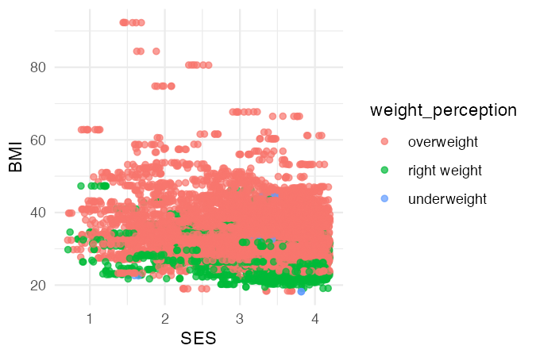
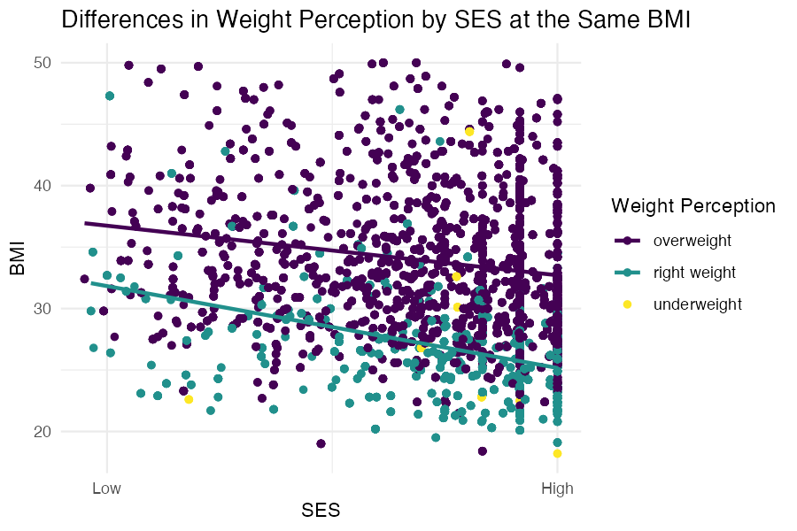

```{r setup, include=FALSE}
knitr::opts_chunk$set(echo=FALSE, eval=TRUE, warning=FALSE, message=FALSE)
```

```{r}
library(rio)
library(here)
library(tidyverse)
library(scales)
```

```{r}
weight1 <- import(here("data", "sesdata.rds"))
```

```{r}
plot11 <- weight1 %>%
ggplot(aes(x = SES, y = BMI, color = weight_perception)) +
  geom_jitter(width = 0.2, alpha = 0.7) +
  theme_minimal()

ggsave("plot11.png", plot11, width=4.5, height=3, dpi = 150)
```

```{r}
plot12 <- weight1 %>%
ggplot(aes(x = SES, y = BMI)) +
  geom_point(aes(color = weight_perception)) +  
  geom_smooth(data = weight1 %>% filter(weight_perception %in% c("overweight", "right weight")),
              aes(color = weight_perception),
              method = "lm", se = FALSE) +
  ylim(NA, 50) +
  scale_color_viridis_d() +
  theme_minimal() +
  scale_x_continuous(breaks = c(1, 4),
                     labels = c("Low", "High")) +
  labs(x = "SES", y = "BMI", color = "Weight Perception",
       title = "Differences in Weight Perception by SES at the Same BMI")

ggsave("plot12.png", plot12, width=6, height=4, dpi = 150)
```

## Final Plot

This plot was created to investigate the association between socioeconomic status (SES) and individuals’ perceptions about their own weight, regardless of their BMI. In today's world where thinness and lean body are considered ideal social values, whether a lean body functions as a capital to maintain SES or not is an interesting topic.

```{r, fig.width=8, fig.height=6}
weight1$SES_group2 <- cut(weight1$SES,
                         breaks = quantile(weight1$SES, probs = c(0, 0.5, 1), na.rm = TRUE),
                         include.lowest = TRUE,
                         labels = c("Low", "High"))

weight1$SES_group2 <- factor(weight1$SES_group2, levels = c("Low", "High"))

weight1 <- weight1 %>%
  distinct(SEQN, .keep_all = TRUE)

ggplot(weight1, aes(x = SES_group2, y = BMI, fill = weight_perception)) +
  geom_boxplot() +
  scale_y_continuous(breaks = c(18.5, 20, 25, 30, 35, 40, 45),
                     labels = c("18.5\n(Underweight))", "20", "25\n(Healthy Range)", "30\n(Overweight)", 
                                "35", "40\n(Obesity)", "45")) +
  coord_cartesian(ylim = c(NA, 45)) +
  labs(x = "Socioeconomic Status",
       y= "BMI",
       title = "BMI by Weight Perception across SES",
       fill = "Weight Perception") +
  scale_fill_viridis_d(option = "viridis", alpha = 0.8) +
  theme_minimal() +
  theme(panel.grid.major.x = element_blank(),
        panel.grid.minor.x = element_blank(),
        panel.grid.major.y = element_line(color = "gray", linetype = "dotted", linewidth = 0.5),
        panel.grid.minor.y = element_blank())
```

Data Source: [NHANES 2017-March 2020](https://wwwn.cdc.gov/nchs/nhanes/continuousnhanes/default.aspx?Cycle=2017-2020)

The finalized plot is a boxplot. SES was categorized into two groups in this boxplot: low and high. Individuals below the 25th percentile are classified as low SES, while those above the 75th percentile are classified as high SES. The plot also compares the BMI of people who perceive themselves as overweight, of the right, or underweight within each SES group. The visualization shows that among those who consider themselves overweight, individuals with low SES have higher BMIs than those with high SES. In other words, people with high SES tend to have a stricter perception of their own weight. A similar pattern was observed among those who perceive themselves as being of the right weight or underweight.

The intended audience for this plot is health-related social science researchers. Since the box plot is a data visualization method frequently used by social scientists, there will not be much difficulty in interpreting it. For researchers interested in topics such as health and social class, this plot will be insightful to study how weight, body shape, and health status function within social class structures.

## Drafts

<div>
  <button onclick="showPlot('plot11')">Draft 1</button>
  <button onclick="showPlot('plot12')">Draft 2</button>
</div>

<div>
(Click the Draft buttons to view previous plots)
</div>

<div id="plot-container">
  
  
</div>

<script>
  function showPlot(plotId) {
    document.getElementById('plot11').style.display = "none";
    document.getElementById('plot12').style.display = "none";
    document.getElementById(plotId).style.display = "block";
  }
</script>

There were dynamic changes in plots until this final plot was completed. The first draft used a jitter plot to spread out the overlapping dots. The dots were color-coded depending on the individual's weight perception, but the jitter plot was too messy to interpret effectively. Accordingly, the second draft changed it to a scatter plot that could reduce the number of dots and applied a color scale that was considerate of color-blind audiences. Regression lines were also added to visualize the trend, but it was still difficult to interpret intuitively. Finally, the box plot was adopted, incorporating information of medically relevant BMI categories. The final version of the plot was able to convey the intended message most clearly and effectively.
