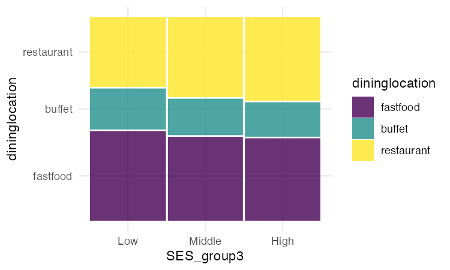
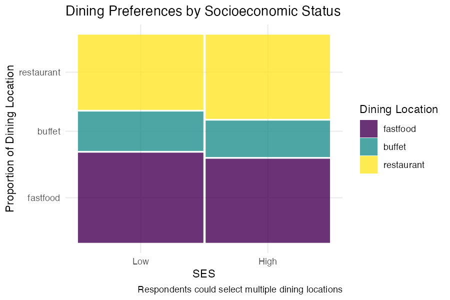

```{r setup, include=FALSE}
knitr::opts_chunk$set(echo=FALSE, eval=TRUE, warning=FALSE, message=FALSE)
```

```{r}
library(rio)
library(here)
library(tidyverse)
library(ggmosaic)
library(scales)
```

```{r}
weight4 <- import(here("data", "sesdata.rds"))
```

```{r}
weight4$SES_group3 <- cut(weight4$SES,
                         breaks = quantile(weight4$SES, probs = c(0, 1/3, 2/3, 1), na.rm = TRUE),
                         include.lowest = TRUE,
                         labels = c("Low", "Middle", "High"))

weight_summary4 <- weight4 %>%
  count(SES_group3, dininglocation)

weight_summary4$dininglocation <- factor(weight_summary4$dininglocation, 
                                        levels = c("fastfood", "buffet", "restaurant"))

plot41 <- ggplot(weight_summary4) +
  geom_mosaic(aes(weight = n, x = product(SES_group3), fill = dininglocation)) +
  scale_fill_viridis_d() +
  theme_minimal()

ggsave("plot41.png", plot41, width=6, height=4, dpi = 150)
```

```{r}
weight4$SES_group2 <- cut(weight4$SES,
                         breaks = quantile(weight4$SES, probs = c(0, 0.5, 1), na.rm = TRUE),
                         include.lowest = TRUE,
                         labels = c("Low", "High"))

weight_summary4 <- weight4 %>%
  count(SES_group2, dininglocation)

weight_summary4$dininglocation <- factor(weight_summary4$dininglocation, 
                                         levels = c("fastfood", "buffet", "restaurant"))

plot42 <- ggplot(weight_summary4) +
  geom_mosaic(aes(weight = n, x = product(SES_group2), fill = dininglocation)) +
  scale_fill_viridis_d() +
  theme_minimal() +
  labs(x = "SES", y = "Proportion of Dining Location", fill = "Dining Location",
       title = "Dining Preferences by Socioeconomic Status",
       caption = "Respondents could select multiple dining locations")

ggsave("plot42.png", plot42, width=6, height=4, dpi = 150)
```

### Final Plot
```{r}
weight4 <- weight4 %>%
  mutate(dininglocation = recode(dininglocation,
                                 "fastfood" = "Fastfood", 
                                 "buffet" = "All-You-Can-It Buffet", 
                                 "restaurant" = "Restaurant with Server"))

weight4$SES_group2 <- cut(weight4$SES,
                         breaks = quantile(weight4$SES, probs = c(0, 0.5, 1), na.rm = TRUE),
                         include.lowest = TRUE,
                         labels = c("Low", "High"))

weight_summary4 <- weight4 %>%
  count(SES_group2, dininglocation)

weight_summary4$dininglocation <- factor(weight_summary4$dininglocation, 
                                         levels = c("fastfood", "buffet", "restaurant"))

weight_summary4 <- weight4 %>%
  count(SES_group2, dininglocation) %>%
  group_by(SES_group2) %>%
  mutate(prop = round(n / sum(n) * 100, 1))

weight_summary4$dininglocation <- factor(weight_summary4$dininglocation, 
                                         levels = c("Fastfood",
                                                    "All-You-Can-It Buffet",
                                                    "Restaurant with Server"))

ggplot(weight_summary4) +
  geom_mosaic(aes(weight = n, x = product(SES_group2), fill = dininglocation)) +
  scale_fill_viridis_d() +
  theme_minimal() +
  theme(panel.grid.major.x = element_blank(),
        panel.grid.minor.x = element_blank(),
        panel.grid.major.y = element_blank(),
        panel.grid.minor.y = element_blank()) +
  labs(x = "SES", y = "Proportion of Dining Location", fill = "Dining Location",
       title = "Dining Preferences by Socioeconomic Status")

ggplot(weight_summary4, aes(x = SES_group2, y = prop, fill = dininglocation)) + 
  geom_col(position = "stack", width = 0.99) + 
  geom_text(aes(label = sprintf("%.1f%%", prop)), 
            position = position_stack(vjust = 0.5), 
            color = "black", size = 5) +
  scale_fill_viridis_d(alpha = 0.8) +
  theme_minimal() +
  theme(panel.grid.major.x = element_blank(),
        panel.grid.minor.x = element_blank(),
        panel.grid.major.y = element_blank(),
        panel.grid.minor.y = element_blank(),
        axis.text.y = element_blank(),
        axis.ticks.y = element_blank(),
        panel.grid = element_blank()) +
  labs(x = "SES", y = NULL, fill = "Dining Location",
       title = "Dining Preferences by Socioeconomic Status")
```

<div>
  <button onclick="showPlot('plot41')">Draft 1</button>
  <button onclick="showPlot('plot42')">Draft 2</button>
</div>

<div>
(Click the Draft buttons to view previous plots)
</div>

<div id="plot-container">
  
  
</div>

<script>
  function showPlot(plotId) {
    document.getElementById('plot41').style.display = "none";
    document.getElementById('plot42').style.display = "none";
    document.getElementById(plotId).style.display = "block";
  }
</script>
