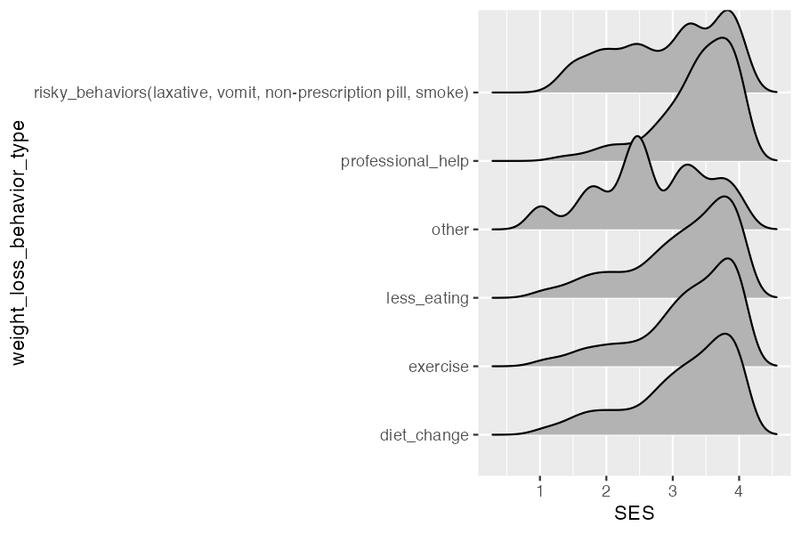
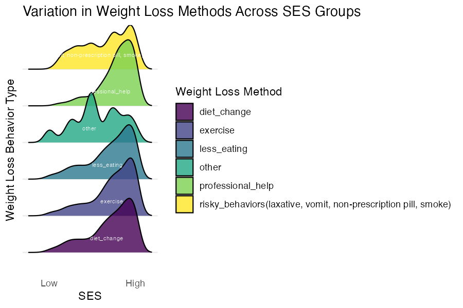

```{r setup, include=FALSE}
knitr::opts_chunk$set(echo=FALSE, eval=TRUE, warning=FALSE, message=FALSE)
```

```{r}
library(rio)
library(here)
library(tidyverse)
library(ggridges)
```

```{r}
weight3 <- import(here("data", "sesdata.rds"))
```

```{r}
plot31 <- weight3 %>%
  ggplot(aes(x = SES, y = weight_loss_behavior_type, group = weight_loss_behavior_type)) +
  geom_density_ridges()

ggsave("plot31.png", plot31, width=4.5, height=3, dpi = 150)
```

```{r}
plot32 <- weight3 %>%
  ggplot(aes(x = SES, y = weight_loss_behavior_type, fill = weight_loss_behavior_type)) +
  geom_density_ridges(alpha = 0.8) +  
  scale_fill_viridis_d() +
  theme_minimal() +
  stat_summary(
    aes(label = weight_loss_behavior_type),  
    fun = median, 
    geom = "text",
    color = "white",  
    size = 2,  
    hjust = 0.8,  
    vjust = -3
  ) +
  theme(axis.text.y = element_blank(),
        panel.grid.major.x = element_blank(),
        panel.grid.minor.x = element_blank()) +
  scale_x_continuous(breaks = c(1, 4),
                     labels = c("Low", "High")) +
  labs(x = "SES", y = "Weight Loss Behavior Type", fill = "Weight Loss Method",
       title = "Variation in Weight Loss Methods Across SES Groups")

ggsave("plot32.png", plot32, width=6, height=4, dpi = 150)
```

### Final Plot
```{r}
weight3 <- weight3 %>%
  mutate(weight_loss_behavior_type = recode(weight_loss_behavior_type,
                                           "risky_behaviors(laxative, vomit, non-prescription pill, smoke)" = "Perform Harmful Behaviors")) %>%
  filter(weight_loss_behavior_type != "other")

weight3$weight_loss_behavior_type <- factor(weight3$weight_loss_behavior_type, 
                                           levels = rev(c("exercise", "diet_change", "less_eating", "professional_help", "Perform Harmful Behaviors")),
                                           labels = rev(c("Exercise", "Change Diet", "Eating Less", "Get Professional Help", "Perform Harmful Behaviors*")))

weight3 %>%
  ggplot(aes(x = SES, y = weight_loss_behavior_type, fill = weight_loss_behavior_type)) +
  geom_density_ridges(alpha = 0.5) +  
  scale_fill_viridis_d(option = "magma") +
  theme_minimal() +
  theme(panel.grid.major.x = element_blank(),
        panel.grid.minor.x = element_blank(),
        plot.caption = element_text(hjust = 5),
        legend.position = "none") +
  scale_x_continuous(breaks = c(0.4, 4.5),
                     labels = c("Lower SES", "Higher SES")) +
  labs(x = "Socioeconomic Status", y = NULL, fill = "Weight Loss Method",
       title = "Trends in Weight Loss Methods Across Socioeconomic Status(SES)",
       caption = "*'Harmful Behaviors' include the use of non-prescription pills, laxatives, vomiting, and smoking")
```

<div>
  <button onclick="showPlot('plot31')">Draft 1</button>
  <button onclick="showPlot('plot32')">Draft 2</button>
</div>

<div>
(Click the Draft buttons to view previous plots)
</div>

<div id="plot-container">
  
  
</div>

<script>
  function showPlot(plotId) {
    document.getElementById('plot31').style.display = "none";
    document.getElementById('plot32').style.display = "none";
    document.getElementById(plotId).style.display = "block";
  }
</script>