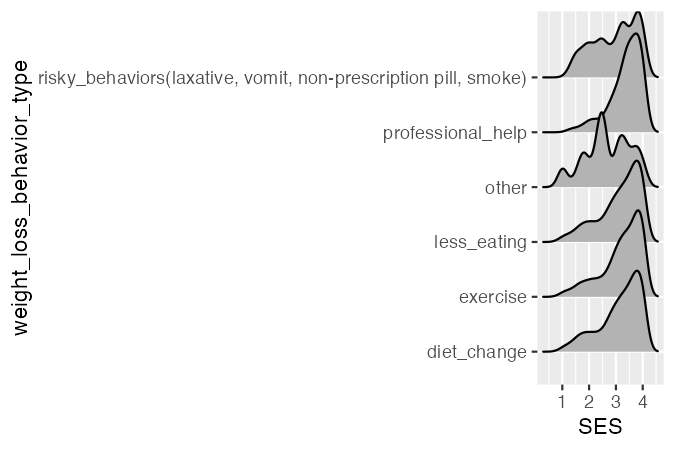

```{r setup, include=FALSE}
knitr::opts_chunk$set(echo=FALSE, eval=TRUE, warning=FALSE, message=FALSE)
```

```{r}
library(rio)
library(here)
library(tidyverse)
library(scales)
library(ggridges)
```

```{r}
weight3 <- import(here("data", "sesdata.rds"))
```

```{r}
plot31 <- weight3 %>%
  ggplot(aes(x = SES, y = weight_loss_behavior_type, group = weight_loss_behavior_type)) +
  geom_density_ridges()

ggsave("plot31.png", plot31, width=4.5, height=3, dpi = 150)
```

```{r}
plot32 <- weight3 %>%
  ggplot(aes(x = SES, y = weight_loss_behavior_type, fill = weight_loss_behavior_type)) +
  geom_density_ridges(alpha = 0.8) +  
  scale_fill_viridis_d() +
  theme_minimal() +
  stat_summary(
    aes(label = weight_loss_behavior_type),  
    fun = median, 
    geom = "text",
    color = "white",  
    size = 2,  
    hjust = 0.8,  
    vjust = -3
  ) +
  theme(axis.text.y = element_blank(),
        panel.grid.major.x = element_blank(),
        panel.grid.minor.x = element_blank()) +
  scale_x_continuous(breaks = c(1, 4),
                     labels = c("Low", "High")) +
  labs(x = "SES", y = "Weight Loss Behavior Type", fill = "Weight Loss Method",
       title = "Variation in Weight Loss Methods Across SES Groups")

ggsave("plot32.png", plot32, width=6, height=4, dpi = 150)
```

## Final Plot

Since differences in SES can lead to differences in the methods individuals use to lose weight, this plot aims to explore how socioeconomic status (SES) is linked with engagement in various weight loss behaviors.

```{r, fig.width=8, fig.height=6}
weight3 <- weight3 %>%
  mutate(weight_loss_behavior_type = recode(weight_loss_behavior_type,
                                           "risky_behaviors(laxative, vomit, non-prescription pill, smoke)" = "Perform Harmful Behaviors")) %>%
  filter(weight_loss_behavior_type != "other")

weight3$weight_loss_behavior_type <- factor(weight3$weight_loss_behavior_type, 
                                           levels = rev(c("exercise", "diet_change", "less_eating", "professional_help", "Perform Harmful Behaviors")),
                                           labels = rev(c("Exercise", "Change Diet", "Eat Less", "Get Professional Help", "Perform Harmful Behaviors*")))

weight3 %>%
  ggplot(aes(x = SES, y = weight_loss_behavior_type, fill = weight_loss_behavior_type)) +
  geom_density_ridges(alpha = 0.8) +  
  scale_fill_viridis_d(option = "magma") +
  theme_minimal() +
  theme(panel.grid.major.x = element_blank(),
        panel.grid.minor.x = element_blank(),
        plot.caption = element_text(hjust = -1.5),
        legend.position = "none",
        plot.margin = margin(5, 20, 5, 5)) +
  scale_x_continuous(breaks = c(0.4, 4.5),
                     labels = c("Lower SES", "Higher SES")) +
  labs(x = "Socioeconomic Status", y = NULL, fill = "Weight Loss Method",
       title = "Choice of Weight Loss Methods by SES",
       caption = "*'Harmful Behaviors' include the use of non-prescription pills, laxatives, vomiting, and smoking") +
  coord_cartesian(clip = "off")
```
Data Source: [NHANES 2017-March 2020](https://wwwn.cdc.gov/nchs/nhanes/continuousnhanes/default.aspx?Cycle=2017-2020)

The finalized plot is a ridgeline plot. In this plot, SES is treated as a continuous variable using raw scores, indicating higher scores as higher SES. Each mountain-shaped figure shows how the distribution of SES changes depending on the weight loss method. Weight loss behaviors were classified into five categories: exercise, change diet, eat less, get professional help, and perform risky behaviors. Risky behaviors include taking non-prescription pills such as laxatives, vomiting, and smoking. Each behavior is represented by a different color using a categorical color palette designed to be colorblind-friendly. 

The plot shows that, overall, as SES increases, individuals engage more in all weight loss behaviors. In particular, seeking help from professionals, which requires financial resources and health insurance, was significantly more common among those with higher SES and much less frequent among those with lower SES. Moreover, the distribution of the low SES group was much denser in the case of harmful behaviors. This highlights a concerning trend: individuals with limited economic and health insurance support and lower levels of education may be more vulnerable to engaging in risky weight loss practices.

The intended audience for this plot includes public health professionals, as well as medical experts. By understanding the relationship between weight loss behaviors and SES, they can develop policies to strengthen health education and create public health interventions. It could be also helpful in providing customized treatment approaches to prevent individuals with low SES from using harmful weight loss methods.

## Drafts

<div>
  <button onclick="showPlot('plot31')">Draft 1</button>
  <button onclick="showPlot('plot32')">Draft 2</button>
</div>

<div>
(Click the Draft buttons to view previous plots)
</div>

<div id="plot-container">
  
  
</div>

<script>
  function showPlot(plotId) {
    document.getElementById('plot31').style.display = "none";
    document.getElementById('plot32').style.display = "none";
    document.getElementById(plotId).style.display = "block";
  }
</script>

Throughout the development process, the ridgeline plot has been refined to clearly convey the intended messages. The first draft successfully visualized the data, but it lacked color distinction, and the labels for each axis were not neatly written. In the second draft, different colors were applied to each behavior and labels for each axis and element were written on the graphs. However, both the legend and individual graphs displayed behavior labels, which made the plot somewhat distracting. In the final plot, therefore, weight loss behavior labels were placed only on one side of the y-axis to maintain simplicity while ensuring clarity. Detailed caption was added to clarify the meaning of harmful behaviors.